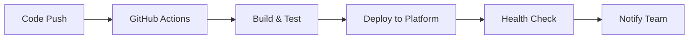

# Deployment Automation Guide for GaiaExchanges

This document provides comprehensive instructions for deploying GaiaExchanges across multiple platforms, including workflow automation, error handling, admin controls, and verification procedures.

## Table of Contents

1. [Overview](#overview)
2. [Push and Deploy Workflow](#push-and-deploy-workflow)
3. [Platform-Specific Instructions](#platform-specific-instructions)
4. [Error Handling](#error-handling)
5. [Admin Exclusivity](#admin-exclusivity)
6. [Verification Steps](#verification-steps)
7. [Troubleshooting](#troubleshooting)

## Overview

GaiaExchanges is a React/TypeScript application built with Vite that supports multiple deployment platforms:

- **Primary**: Vercel (configured)
- **Alternative**: Netlify
- **CI/CD**: GitHub Actions
- **Backend**: Supabase Edge Functions

### Project Structure
```
├── src/                     # React application source
├── public/                  # Static assets
├── dist/                    # Build output
├── supabase/               # Backend functions
├── .github/workflows/      # GitHub Actions
├── vercel.json            # Vercel configuration
└── package.json           # Build scripts and dependencies
```

## Push and Deploy Workflow

### Automated Deployment Flow

1. **Code Push** → **Build Trigger** → **Deployment** → **Verification**



### Standard Workflow Steps

1. **Development Phase**
   ```bash
   npm run dev          # Local development
   npm run lint         # Code quality check
   npm run build        # Production build test
   ```

2. **Pre-deployment Checks**
   ```bash
   # Verify build integrity
   npm run build
   
   # Check for critical issues
   npm run lint --fix
   
   # Validate environment configuration
   npm run preview
   ```

3. **Deployment Trigger**
   - **Automatic**: Push to `main` branch
   - **Manual**: GitHub Actions workflow dispatch
   - **Manual**: Platform-specific deployment commands

## Platform-Specific Instructions

### Vercel Deployment

#### Current Configuration
The project is pre-configured for Vercel with `vercel.json`:

```json
{
  "buildCommand": "npm run build",
  "outputDirectory": "dist",
  "devCommand": "npm run dev",
  "installCommand": "npm install",
  "rewrites": [
    {
      "source": "/(.*)",
      "destination": "/index.html"
    }
  ]
}
```

#### Deployment Methods

**Method 1: Automatic (GitHub Integration)**
1. Connect repository to Vercel
2. Configure auto-deployment on push
3. Set environment variables in Vercel dashboard

**Method 2: CLI Deployment**
```bash
# Install Vercel CLI
npm i -g vercel

# Login and deploy
vercel login
vercel --prod

# Environment setup
vercel env add VITE_SUPABASE_URL
vercel env add VITE_SUPABASE_ANON_KEY
```

**Method 3: Manual Upload**
```bash
npm run build
# Upload dist/ folder via Vercel dashboard
```

#### Vercel Environment Variables
Required environment variables:
- `VITE_SUPABASE_URL`
- `VITE_SUPABASE_ANON_KEY`
- `NODE_VERSION=18.x`

### Netlify Deployment

#### Configuration Setup
Create `netlify.toml` in root directory:

```toml
[build]
  publish = "dist"
  command = "npm run build"

[build.environment]
  NODE_VERSION = "18"

[[redirects]]
  from = "/*"
  to = "/index.html"
  status = 200

[context.production.environment]
  VITE_NODE_ENV = "production"

[context.branch-deploy.environment]
  VITE_NODE_ENV = "development"
```

#### Deployment Methods

**Method 1: Git Integration**
1. Connect repository to Netlify
2. Set build command: `npm run build`
3. Set publish directory: `dist`
4. Configure environment variables

**Method 2: CLI Deployment**
```bash
# Install Netlify CLI
npm install -g netlify-cli

# Login and initialize
netlify login
netlify init

# Deploy
netlify build
netlify deploy --prod
```

**Method 3: Drag & Drop**
```bash
npm run build
# Upload dist/ folder to Netlify dashboard
```

#### Netlify Environment Variables
Set in Netlify dashboard under Site Settings > Environment Variables:
- `VITE_SUPABASE_URL`
- `VITE_SUPABASE_ANON_KEY`
- `NODE_VERSION=18`

### GitHub Actions Deployment

#### Current Workflow
The project includes a SLSA security workflow at `.github/workflows/generator-generic-ossf-slsa3-publish.yml`.

#### Custom Deployment Workflow
Create `.github/workflows/deploy.yml`:

```yaml
name: Deploy GaiaExchanges

on:
  push:
    branches: [ main ]
  workflow_dispatch:

jobs:
  build-and-deploy:
    runs-on: ubuntu-latest
    
    steps:
    - name: Checkout
      uses: actions/checkout@v4
      
    - name: Setup Node.js
      uses: actions/setup-node@v4
      with:
        node-version: '18'
        cache: 'npm'
        
    - name: Install dependencies
      run: npm ci
      
    - name: Lint code
      run: npm run lint
      
    - name: Build application
      run: npm run build
      env:
        VITE_SUPABASE_URL: ${{ secrets.VITE_SUPABASE_URL }}
        VITE_SUPABASE_ANON_KEY: ${{ secrets.VITE_SUPABASE_ANON_KEY }}
        
    - name: Deploy to Vercel
      uses: amondnet/vercel-action@v25
      with:
        vercel-token: ${{ secrets.VERCEL_TOKEN }}
        vercel-org-id: ${{ secrets.ORG_ID }}
        vercel-project-id: ${{ secrets.PROJECT_ID }}
        vercel-args: '--prod'
```

#### Required Secrets
Configure in GitHub Repository Settings > Secrets:

**Core Application Secrets:**
- `VITE_SUPABASE_URL` - Supabase project URL
- `VITE_SUPABASE_ANON_KEY` - Supabase anonymous key

**Deployment Secrets:**
- `VERCEL_TOKEN` - Vercel deployment token
- `VERCEL_ORG_ID` - Vercel organization ID  
- `VERCEL_PROJECT_ID` - Vercel project ID

**Notification Secrets (for failure alerts):**
- `SLACK_WEBHOOK_URL` - Slack incoming webhook URL for deployment notifications
- `DISCORD_WEBHOOK_URL` - Discord webhook URL for deployment alerts
- `EMAIL_USERNAME` - SMTP email username (e.g., Gmail address)
- `EMAIL_PASSWORD` - SMTP email password or app-specific password
- `NOTIFICATION_EMAIL` - Email address to receive deployment failure notifications

**Admin Control Secrets:**
- `ADMIN_EMAILS` - Comma-separated list of admin email addresses
- `ADMIN_USER_IDS` - Comma-separated list of admin user IDs
- `ADMIN_ROLES` - Comma-separated list of admin role names (default: admin,super_admin)
- `REQUIRE_TWO_FACTOR` - Set to 'true' to require 2FA for admin access

## Notification Systems and Operational Routines

### Automated Notification Setup

The deployment workflow includes automated failure notifications through multiple channels:

#### Slack Notifications
Configure Slack webhook for team notifications:
1. Go to your Slack workspace settings
2. Create a new incoming webhook
3. Set `SLACK_WEBHOOK_URL` secret in GitHub repository
4. Notifications will include deployment status and failure details

#### Discord Notifications  
Set up Discord webhook for community alerts:
1. Go to Discord channel settings
2. Create webhook URL
3. Set `DISCORD_WEBHOOK_URL` secret in GitHub repository
4. Failed deployments trigger immediate Discord alerts

#### Email Notifications
Configure SMTP email for critical alerts:
1. Use Gmail with app-specific password (recommended)
2. Set `EMAIL_USERNAME`, `EMAIL_PASSWORD`, and `NOTIFICATION_EMAIL` secrets
3. Email includes detailed failure information and GitHub Actions links

### Health Monitoring and API Endpoints

#### Health Check Endpoint
- **URL**: `/api/health`
- **Method**: GET
- **Response**: JSON with system status, database connectivity, and environment info
- **Automated**: Runs after each deployment to verify system health

#### Admin API Endpoints
- **URL**: `/api/admin/check`
- **Method**: GET
- **Auth**: Requires admin privileges
- **Purpose**: Verify admin access and permissions

### Operational Routines

#### Daily Operations
1. **Morning Health Check**: Automated via cron job or external monitoring
2. **Performance Review**: Check Core Web Vitals and response times
3. **Error Monitoring**: Review Sentry/logging dashboards for issues
4. **Security Scan**: Automated dependency vulnerability scanning

#### Weekly Operations
1. **Admin Access Review**: Verify admin user list and permissions
2. **Secret Rotation**: Rotate API keys and tokens (quarterly schedule)
3. **Deployment Analysis**: Review deployment success rates and timing
4. **Backup Verification**: Ensure database backups are functioning

#### Monthly Operations
1. **Security Audit**: Complete security review of admin controls
2. **Performance Optimization**: Analyze and optimize bundle sizes
3. **Documentation Update**: Keep deployment docs current
4. **Disaster Recovery Test**: Test rollback procedures

### Admin Control Configuration

#### Environment Variables for Admin Controls
```bash
# Admin user configuration
ADMIN_EMAILS=admin@example.com,superadmin@example.com
ADMIN_USER_IDS=user-id-1,user-id-2
ADMIN_ROLES=admin,super_admin
REQUIRE_TWO_FACTOR=true
```

#### Admin Middleware Usage
```typescript
import { withAdminOnly } from '../middleware/adminOnly';

// Protect API endpoints
export default withAdminOnly(async (req, res) => {
  // Admin-only functionality here
});
```

#### Client-side Admin Checking
```typescript
import { useAdminAuth } from '../middleware/adminOnly';

const { checkAdminStatus } = useAdminAuth();
const { isAdmin } = await checkAdminStatus(userToken);
```

### Incident Response Procedures

#### Deployment Failure Response
1. **Immediate**: Automated notifications sent to all channels
2. **5 minutes**: Admin team reviews GitHub Actions logs
3. **15 minutes**: Rollback decision made if issue not resolved
4. **30 minutes**: Post-mortem scheduled if rollback performed

#### Security Incident Response
1. **Detection**: Admin middleware blocks unauthorized access
2. **Logging**: All admin access attempts logged and monitored
3. **Response**: Immediate secret rotation if compromise suspected
4. **Recovery**: Admin access audit and permission review

#### System Health Degradation
1. **Health Check Failure**: Automated retry after 30 seconds
2. **Persistent Issues**: Escalation to admin notification channels
3. **Critical Failure**: Manual intervention and rollback procedures
4. **Recovery**: Health verification and incident documentation

### Monitoring and Alerting Configuration

#### Recommended External Monitoring
- **Uptime**: Pingdom, StatusPage, or UptimeRobot
- **Performance**: Google PageSpeed, GTmetrix
- **Security**: Snyk, GitHub Security Advisories
- **Logs**: Vercel Analytics, Supabase Dashboard

#### Alert Thresholds
- **Response Time**: >3 seconds for 95th percentile
- **Error Rate**: >1% of requests failing
- **Availability**: <99.9% uptime over 24 hours
- **Security**: Any unauthorized admin access attempts

### Common Build Errors

#### TypeScript Errors
```bash
# TypeScript linting errors may occur during development
# These errors are non-blocking for deployment but should be addressed

# Quick fix for deployment
NODE_ENV=production npm run build

# Proper fix
npm run lint --fix
```

#### Dependency Issues
```bash
# Clear cache and reinstall
rm -rf node_modules package-lock.json
npm install

# Update dependencies
npm update
npm audit fix
```

#### Environment Variable Errors
```bash
# Verify environment variables
echo $VITE_SUPABASE_URL
echo $VITE_SUPABASE_ANON_KEY

# Create .env.local for testing
VITE_SUPABASE_URL=your_url_here
VITE_SUPABASE_ANON_KEY=your_key_here
```

### Deployment Error Recovery

#### Rollback Procedures
**Vercel:**
```bash
# List deployments
vercel ls

# Rollback to previous version
vercel rollback [deployment-url]
```

**Netlify:**
```bash
# View deployments
netlify sites:list

# Rollback via dashboard or CLI
netlify api rollbackSiteDeploy --site-id [site-id] --deploy-id [deploy-id]
```

#### Health Check Failures
1. Verify application starts correctly
2. Check for JavaScript console errors
3. Validate API connectivity
4. Test critical user flows

### Error Monitoring

#### Sentry Integration (Recommended)
```bash
npm install @sentry/react @sentry/tracing

# Add to main.tsx
import * as Sentry from "@sentry/react";

Sentry.init({
  dsn: "YOUR_DSN_HERE",
  environment: import.meta.env.MODE,
});
```

## Admin Exclusivity

### Access Control Levels

#### Repository Access
- **Owner**: Full repository and deployment control
- **Admin**: Repository management, deployment approval
- **Maintainer**: Code review, limited deployment access
- **Developer**: Code contribution only

#### Deployment Permissions

**Production Deployment (Admin Only)**
- Requires admin approval for main branch protection
- Two-factor authentication mandatory
- Deployment key rotation quarterly

**Staging Deployment (Maintainer+)**
- Automatic deployment from develop branch
- Manual approval for production promotion

### Protected Branch Configuration

```yaml
# GitHub branch protection rules for main
required_status_checks:
  strict: true
  contexts:
    - "build-and-test"
    - "security-scan"
    
enforce_admins: true
required_pull_request_reviews:
  required_approving_review_count: 2
  dismiss_stale_reviews: true
  require_code_owner_reviews: true
  
restrictions:
  users: []
  teams: ["admin-team"]
```

### Environment Access Control

#### Production Environment Variables
- Managed exclusively by repository admins
- Encrypted at rest in platform secrets
- Audit log for all changes
- Regular rotation schedule

#### API Key Management
```bash
# Supabase key rotation
# 1. Generate new key in Supabase dashboard
# 2. Update in deployment platform
# 3. Verify deployment health
# 4. Revoke old key
```

## Verification Steps

### Pre-deployment Verification

#### Code Quality Checklist
- [ ] All tests passing
- [ ] Linting errors addressed
- [ ] Security scan completed
- [ ] Performance metrics acceptable
- [ ] Breaking changes documented

#### Build Verification
```bash
# Verify build succeeds
npm run build

# Check build output
ls -la dist/

# Verify assets are generated
find dist/ -name "*.js" -o -name "*.css" | wc -l
```

### Post-deployment Verification

#### Automated Health Checks
```bash
# Basic connectivity
curl -f https://your-app.vercel.app/

# API health check
curl -f https://your-app.vercel.app/api/health

# Performance check
curl -w "@curl-format.txt" -o /dev/null -s https://your-app.vercel.app/
```

#### Manual Verification Checklist
- [ ] Application loads without errors
- [ ] Authentication works correctly
- [ ] Core features functional
- [ ] Mobile responsiveness verified
- [ ] Performance within acceptable limits
- [ ] No console errors
- [ ] Analytics tracking active

#### Monitoring Setup
1. **Uptime Monitoring**: Set up Pingdom/StatusPage
2. **Error Tracking**: Configure Sentry alerts
3. **Performance**: Monitor Core Web Vitals
4. **User Analytics**: Verify tracking implementation

### Rollback Criteria
Immediate rollback if:
- Application fails to load
- Critical functionality broken
- Security vulnerability exposed
- Performance degradation >50%
- Data corruption detected

## Troubleshooting

### Common Issues

#### Build Timeouts
```bash
# Increase Node.js memory
NODE_OPTIONS="--max-old-space-size=4096" npm run build

# Optimize bundle size
npm run build -- --analyze
```

#### Environment Variable Issues
```bash
# Debug environment loading (for development only; do not use in production)
console.log('Environment:', import.meta.env);

# Verify variable naming (must start with VITE_)
VITE_API_URL=https://api.example.com
```

#### Supabase Connection Issues
```bash
# Test connection
curl -H "apikey: YOUR_ANON_KEY" \
     "YOUR_SUPABASE_URL/rest/v1/"

# Verify CORS settings in Supabase dashboard
```

### Support Contacts

- **Technical Issues**: Create GitHub issue
- **Deployment Problems**: Contact platform support
- **Security Concerns**: Email security@yourdomain.com
- **Emergency**: Use incident response procedures

### Logs and Debugging

#### Vercel Logs
```bash
vercel logs [deployment-url]
vercel logs --follow
```

#### Netlify Logs
```bash
netlify logs
netlify logs --live
```

#### Browser Console
- Check for JavaScript errors
- Verify network requests
- Monitor performance metrics

---

## Quick Reference

### Deployment Commands
```bash
# Local development
npm run dev

# Production build
npm run build

# Deploy to Vercel
vercel --prod

# Deploy to Netlify
netlify deploy --prod

# Trigger GitHub Actions
git push origin main
```

### Emergency Procedures
1. Check deployment status
2. Review recent changes
3. Check error logs
4. Rollback if necessary
5. Notify team
6. Document incident

This guide should be updated regularly to reflect changes in deployment procedures and platform configurations.