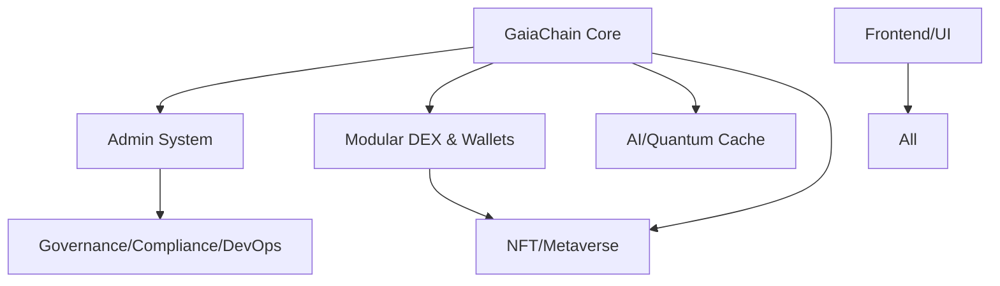

# GaiaExchanges Module Integration Guide

## Overview

This document provides comprehensive guidance on integrating and using the GaiaExchanges 7-module system. The modules are designed to be fully additive and backward compatible with the existing system.

## Architecture Overview

```
GaiaExchanges Ecosystem
├── Existing System (Preserved)
│   ├── Pages (src/pages/*)
│   ├── Components (src/components/*)
│   ├── Services (src/services/*)
│   └── Hooks (src/hooks/*)
└── New Module System (Additive)
    ├── GaiaChain Core
    ├── Admin System
    ├── Modular DEX & Wallets
    ├── AI/Quantum Cache
    ├── NFT/Metaverse
    ├── Frontend/UI
    └── Governance/Compliance/DevOps
```

## Module Dependencies

The modules follow a dependency hierarchy that ensures proper initialization order:



## Quick Start

### 1. Basic Module Usage

```typescript
import { 
  moduleIntegrationService, 
  initializeGaiaModules,
  checkModuleHealth 
} from '@/modules';

// Initialize the module system
const moduleSystem = await initializeGaiaModules();

// Check module health
const healthCheck = await checkModuleHealth();
console.log('System Health:', healthCheck);
```

### 2. Using Blockchain Services

```typescript
import { BlockchainService, useBlockchain } from '@/modules';

// In a service
const blockchainService = new BlockchainService();
await blockchainService.initializeChain();

// In a React component
function MyComponent() {
  const { chainState, isLoading, error } = useBlockchain();
  
  if (isLoading) return <div>Loading blockchain...</div>;
  if (error) return <div>Error: {error}</div>;
  
  return <div>Block Height: {chainState?.height}</div>;
}
```

### 3. Adding Module Components to Existing Pages

```typescript
// In any existing page (e.g., src/pages/Index.tsx)
import { BlockchainStatus } from '@/modules';

export default function Index() {
  return (
    <div>
      {/* Existing content preserved */}
      <h1>Welcome to GaiaExchanges</h1>
      
      {/* New module component added */}
      <BlockchainStatus />
    </div>
  );
}
```

## Integration Patterns

### 1. Event-Driven Communication

```typescript
// Subscribe to module events
await moduleIntegrationService.subscribeToEvents(
  'my-module',
  'blockchain_event',
  (event) => {
    console.log('Blockchain event received:', event);
  }
);

// Send events between modules
await moduleIntegrationService.sendEvent({
  source: 'trading-module',
  type: 'trade_executed',
  payload: { tradeId: '123', amount: 1000 }
});
```

### 2. Cross-Module Services

```typescript
// Send messages between modules
const response = await moduleIntegrationService.sendMessage({
  from: 'trading-module',
  to: 'blockchain-module',
  method: 'validateTransaction',
  params: { transactionId: 'tx_123' }
});

if (response.success) {
  console.log('Transaction validated:', response.data);
}
```

### 3. Configuration Management

```typescript
// Update module configuration
await moduleIntegrationService.updateModuleConfig('ai-cache', {
  features: { 
    predictiveCache: true,
    quantumOptimization: false 
  }
});
```

## Module-Specific Integration

### GaiaChain Core
- **Purpose**: Foundation blockchain infrastructure
- **Integration**: Import blockchain services, hooks, and components
- **Key Exports**: `BlockchainService`, `useBlockchain`, `BlockchainStatus`

### Admin System
- **Purpose**: Enhanced administrative controls
- **Integration**: Extends existing admin pages with new services
- **Key Exports**: `AdminAuthService`, `UserManagementService`

### Modular DEX & Wallets
- **Purpose**: Advanced trading and wallet management
- **Integration**: Enhances existing Exchange and Wallet pages
- **Key Exports**: `TradingService`, `WalletService`, `LiquidityService`

### AI/Quantum Cache
- **Purpose**: Intelligent performance optimization
- **Integration**: Automatically optimizes all system performance
- **Key Exports**: `AICacheService`, `QuantumOptimizerService`

### NFT/Metaverse
- **Purpose**: NFT marketplace and virtual worlds
- **Integration**: Extends existing NFT components with 3D capabilities
- **Key Exports**: `NFTMarketplaceService`, `MetaverseService`

### Frontend/UI
- **Purpose**: Enhanced design system and components
- **Integration**: Provides theming and improved UI components
- **Key Exports**: `ThemeService`, `ComponentLibraryService`

### Governance/Compliance/DevOps
- **Purpose**: Operational management and governance
- **Integration**: Provides oversight and governance tools
- **Key Exports**: `GovernanceService`, `ComplianceService`, `DevOpsService`

## Backward Compatibility

All modules are designed to be fully backward compatible:

1. **No Breaking Changes**: Existing components and pages continue to work unchanged
2. **Additive Only**: New functionality is added without modifying existing code
3. **Optional Integration**: Modules can be used independently or together
4. **Graceful Degradation**: System works even if some modules fail to load

## Performance Considerations

1. **Lazy Loading**: Modules are loaded on-demand to reduce initial bundle size
2. **Code Splitting**: Each module is bundled separately for optimal loading
3. **Caching**: AI/Quantum Cache module optimizes performance automatically
4. **Resource Management**: Each module has configurable resource limits

## Error Handling

```typescript
try {
  const result = await moduleIntegrationService.loadModule('custom-module');
  if (!result) {
    console.warn('Module failed to load');
  }
} catch (error) {
  console.error('Module loading error:', error);
}
```

## Monitoring and Health Checks

```typescript
// Get module status
const statuses = await moduleIntegrationService.getModuleStatus();
statuses.forEach(status => {
  console.log(`${status.moduleId}: ${status.health}`);
});

// Monitor module metrics
moduleIntegrationService.updateModuleMetrics('trading-module', {
  requestCount: 1000,
  responseTime: 150,
  errorCount: 2
});
```

## Development Workflow

1. **Add New Features**: Create components in appropriate module directories
2. **Update Registry**: Add new exports to module registry
3. **Test Integration**: Verify module loading and cross-module communication
4. **Update Documentation**: Document new features and integration points

## Best Practices

1. **Module Isolation**: Keep modules loosely coupled and self-contained
2. **Event-Driven Design**: Use events for cross-module communication
3. **Configuration-Based**: Make features configurable rather than hardcoded
4. **Error Resilience**: Handle module failures gracefully
5. **Performance First**: Consider performance impact of all integrations

## Troubleshooting

### Module Not Loading
- Check dependencies are satisfied
- Verify module configuration
- Check console for error messages

### Poor Performance
- Enable AI/Quantum Cache module
- Review module resource limits
- Monitor module metrics

### Integration Issues
- Verify module exports are correct
- Check event subscription setup
- Review cross-module communication patterns